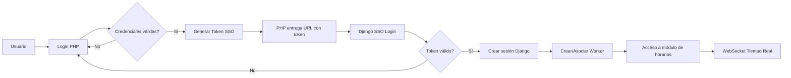
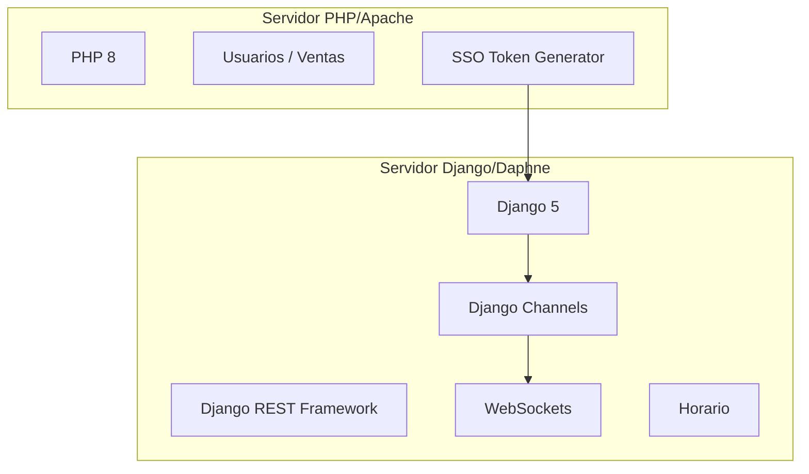
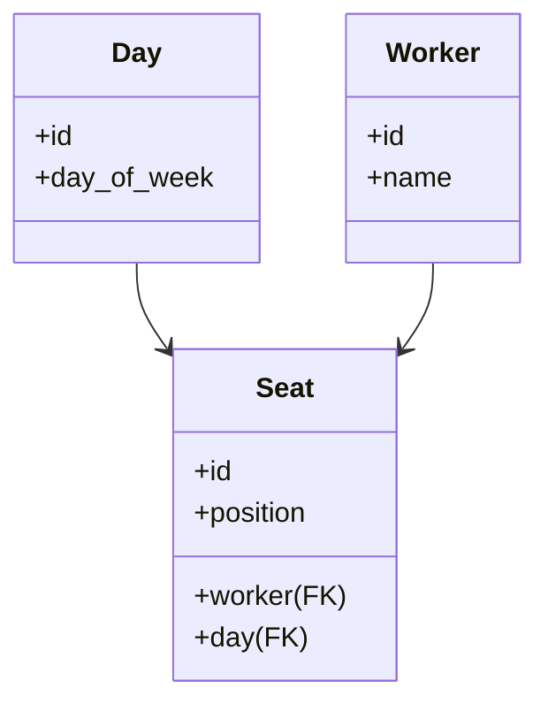
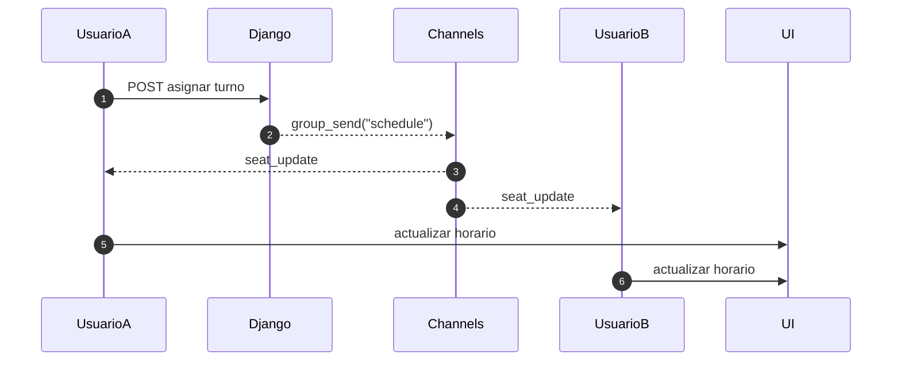
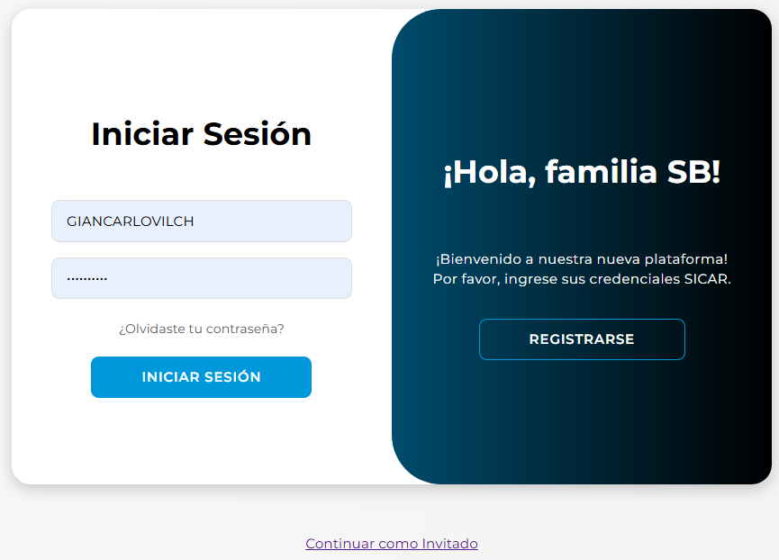
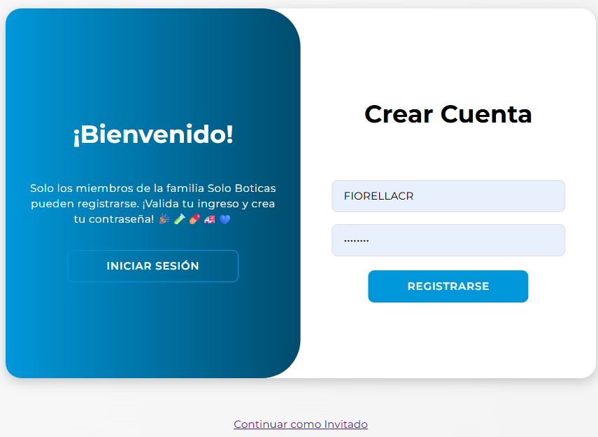
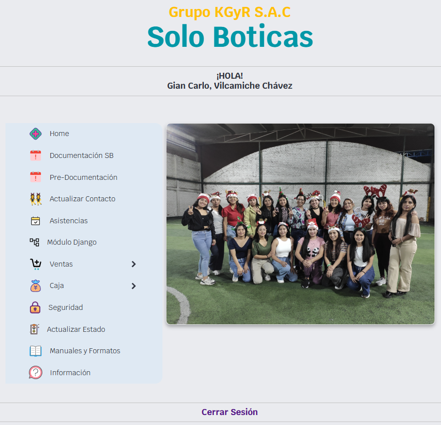
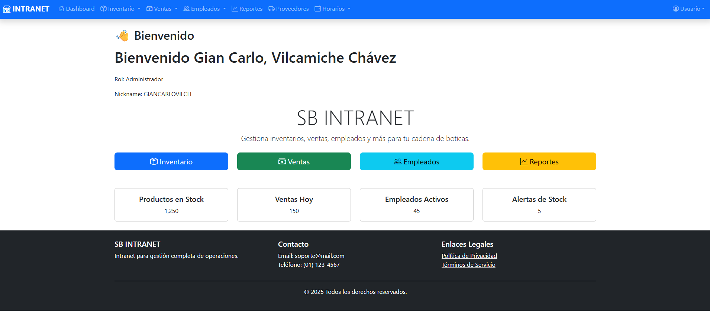
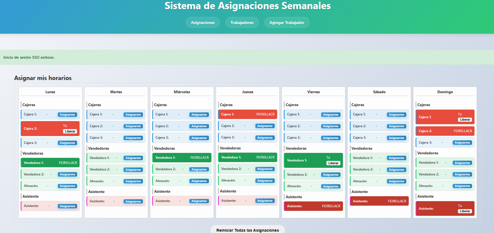
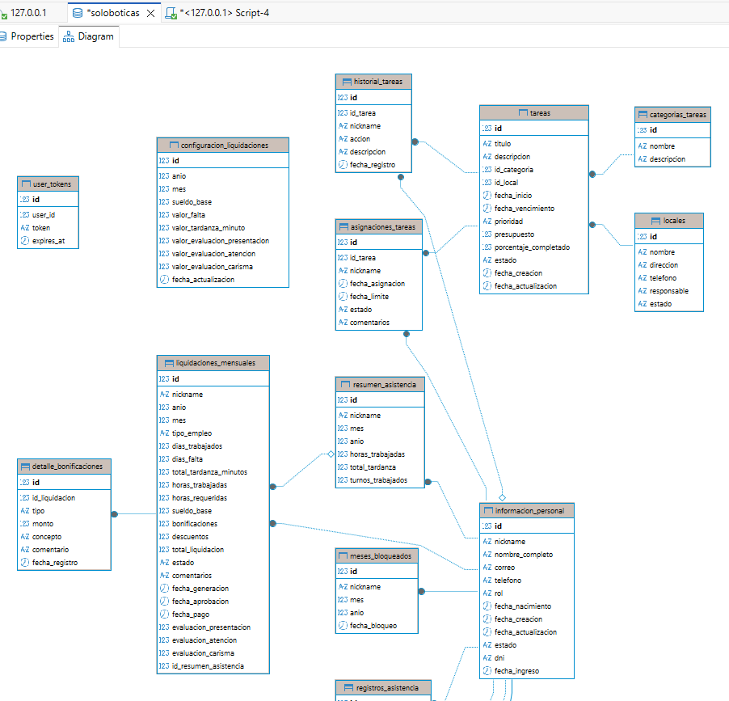

# Intranet de Gestión Empresarial SB

Estudiante: Gian Carlo

https://github.com/giancarlovilch/FS

Este proyecto es la **evolución de la intranet** para una cadena de boticas.  
Mientras que el sistema existente en **PHP** gestiona **ventas e inventario**,  
este nuevo sistema en **Django** se centra en la **gestión integral de personal**, **reportes** y **administración organizacional**.

👉 Django **no reemplaza al sistema PHP**, sino que lo complementa a través de **APIs seguras**.

---

[TOC]

---


# **1. DESCRIPCIÓN DEL PROBLEMA**


------

## **1. Descripción del problema**

Las operaciones internas de la empresa presentaban diversas limitaciones debido al uso de sistemas independientes, procesos manuales y falta de integración entre áreas. En el contexto real de la organización, existían tres problemas críticos:

### **1.1 Falta de un sistema centralizado de gestión de horarios y actividades internas**

Los trabajadores administraban sus horarios mediante:

- mensajería informal (WhatsApp, llamadas)
- hojas de cálculo enviadas entre áreas
- acuerdos verbales para cubrir turnos
- asignaciones manuales hechas por un supervisor

Esto generaba:

- inconsistencias en la asignación de turnos
- duplicación de funciones
- confusión entre usuarios
- falta de trazabilidad sobre qué trabajador ocupó qué turno
- imposibilidad de ver cambios en tiempo real
- pérdida de información entre turnos o durante cambios de personal

------

### **1.2 Dependencia de sistemas aislados (PHP y Django) sin comunicación entre sí**

La empresa ya contaba con un sistema PHP heredado (legacy) para:

- usuarios
- roles
- autenticación básica

Pero los nuevos módulos creados en Django como:

- gestión de horarios
- administración interna
- skills
- reportes

no tenían forma de compartir usuarios ni sesiones con el sistema original.

Esto generaba:

- *doble login*
- duplicidad de usuarios
- credenciales inconsistentes
- baja seguridad por sesiones paralelas
- mala experiencia para el trabajador
- sobrecarga administrativa al tener que sincronizar dos plataformas distintas

------

### **1.3 Ausencia de actualización en tiempo real**

Como el sistema anterior no contaba con WebSockets ni mecanismos de notificación, los cambios en los horarios debían reflejarse recargando la página o reenviando documentos.

Esto producía:

- falta de visibilidad inmediata de los cambios
- riesgo de conflictos cuando dos trabajadores tomaban el mismo turno
- errores por desfase de información
- mayor carga para el supervisor

------

### **1.4 Problemas derivados de la gestión manual**

Además, la falta de un sistema automatizado ocasionaba problemas operativos:

- dificultad para auditar la asignación de turnos
- imposibilidad de registrar histórico (quién ocupó cada turno)
- imposibilidad de liberar o reasignar turnos sin intervención de un supervisor
- falta de control de acceso basado en roles
- poca escalabilidad ante la entrada de nuevos trabajadores

---


# **2. JUSTIFICACIÓN DE LA SOLUCIÓN**


------

## **2. Justificación de la solución**

Con base en los problemas identificados, se planteó una solución tecnológica integral que reemplaza los procesos manuales, unifica los sistemas existentes y permite una gestión moderna y escalable de los horarios internos. La justificación se fundamenta en los siguientes aspectos:

------

### **2.1 Integración de sistemas mediante autenticación unificada (SSO)**

El sistema original en PHP ya administraba los usuarios de la organización.
 En lugar de duplicar la base de datos o crear dos logins independientes, se implementó:

#### **Single Sign-On (SSO) entre PHP y Django**

Esto permite:

- iniciar sesión una sola vez en PHP
- generar un token temporal seguro
- acceder automáticamente a Django sin volver a autenticarse
- evitar duplicidad de credenciales
- mantener un control centralizado de usuarios
- mejorar la seguridad (tokens con expiración)

La integración entre lenguajes diferentes demuestra una arquitectura madura capaz de evolucionar sin desechar sistemas previos.

------

### **2.2 Migración progresiva mediante arquitectura híbrida PHP + Django**

La empresa ya utilizaba módulos escritos en PHP.
 Sin embargo, nuevas necesidades como WebSockets, tiempo real y APIs escalables exigían una tecnología moderna (Django).

En lugar de reemplazar el sistema antiguo, se optó por:

#### **Mantener PHP como sistema de ventas y autenticación**

#### **Implementar Django como módulo de operaciones internas**

Esto garantiza:

- continuidad operativa
- menor tiempo de desarrollo
- bajo impacto en el negocio
- reutilización del código existente
- menor costo que reescribir todo desde cero

------

### **2.3 Gestión de horarios automática y en tiempo real**

El módulo de horarios fue diseñado para resolver los problemas operativos de asignación manual.

La solución implementada incluye:

#### **Asignación y liberación de turnos**

#### **Prevención de conflictos entre usuarios**

#### **Visualización inmediata gracias a WebSockets**

#### **Historial y trazabilidad**

#### **Actualización simultánea entre trabajadores**

La incorporación de **Django Channels + Daphne** permite manejar cientos de actualizaciones en tiempo real sin recargar la página.

------

### **2.4 Uso de estándares modernos de desarrollo**

La arquitectura se basa en tecnologías ampliamente aceptadas en la industria:

- **Django 5** para el módulo interno
- **Django REST Framework** para APIs
- **WebSockets** para sincronización
- **PHP 8** como sistema heredado con mejoras
- **HTML5 + CSS3 + Bootstrap** para interfaz
- **ASGI** para manejar eventos concurrentes
- **SQLite / MySQL** según ambiente

Esto asegura:

- mantenimiento a largo plazo
- escalabilidad
- facilidad de soporte
- cumplimiento de buenas prácticas

------

### **2.5 Eficiencia operativa y reducción de errores humanos**

El sistema propuesto permite:

- que el propio trabajador administre sus turnos
- que los cambios sean visibles inmediatamente
- reducir dependencia de supervisores
- eliminar procesos manuales y no auditables
- mejorar la comunicación interna
- disponer de un registro histórico confiable

Esto incrementa la eficiencia y reduce errores operativos críticos.

------

### **2.6 Escalabilidad para nuevos módulos**

El diseño modular permite agregar:

- reportes automáticos
- análisis de productividad
- gestión de skills
- asignación inteligente por IA
- disponibilidad móvil
- roles y permisos avanzados

Sin necesidad de cambiar la arquitectura base.

---


#  **3. TECNOLOGÍAS UTILIZADAS**


La solución propuesta combina tecnologías modernas y componentes heredados, integrando lenguajes, frameworks y protocolos orientados a lograr un sistema estable, escalable y compatible con los sistemas ya existentes en la empresa. A continuación, se detallan las tecnologías empleadas y la justificación de su uso.

------

### **3.1 Lenguajes de programación**

| Tecnología      | Versión | Motivo de uso                                                |
| --------------- | ------- | ------------------------------------------------------------ |
| **PHP 8**       | Actual  | Sistema heredado de la empresa (ventas, usuarios, roles). Permite aprovechar la infraestructura existente sin reescribir el sistema desde cero. |
| **Python 3.12** | Actual  | Base del nuevo módulo interno, orientado a APIs modernas, WebSockets, automatización y escalabilidad. Permite agregar funciones avanzadas sin comprometer el sistema legacy. |

------

### **3.2 Frameworks y librerías principales**

| Tecnología                      | Uso principal              | Justificación                                                |
| ------------------------------- | -------------------------- | ------------------------------------------------------------ |
| **Django 5**                    | Backend del módulo interno | Framework robusto, seguro, modular y mantenible. Facilita la creación de aplicaciones escalables y ordenadas. |
| **Django REST Framework (DRF)** | Construcción de APIs REST  | Permite crear endpoints limpios, seguros y bien estructurados para manipular datos y facilitar integraciones. |
| **Django Channels**             | WebSockets, tiempo real    | Extiende Django para soportar conexiones persistentes. Es indispensable para la actualización en vivo de los horarios. |
| **Daphne**                      | Servidor ASGI              | Reemplaza `runserver` para permitir WebSockets en producción y desarrollo. Optimizado para sistemas event-driven. |
| **Bootstrap 5**                 | Frontend, estilos base     | Garantiza diseño responsive, uniforme y profesional sin necesidad de CSS complejo. |

------

### **3.3 Tecnologías de comunicación y seguridad**

| Tecnología                          | Función                   | Justificación                                                |
| ----------------------------------- | ------------------------- | ------------------------------------------------------------ |
| **SSO Token System (PHP → Django)** | Autenticación unificada   | Permite que el usuario inicie sesión una sola vez y acceda automáticamente al módulo Django. Evita duplicidad de credenciales. |
| **Token temporal con expiración**   | Seguridad                 | Garantiza sesiones seguras entre sistemas heterogéneos (PHP y Python). |
| **Django Session Middleware**       | Manejo de sesiones        | Administra sesiones seguras en Django con expiración configurable por tiempo o cierre de navegador. |
| **CSRF Tokens**                     | Protección de formularios | Requerido para evitar ataques CSRF en operaciones CRUD.      |

------

### **3.4 Bases de datos**

| Base de Datos                       | Uso                                  | Motivo                                                       |
| ----------------------------------- | ------------------------------------ | ------------------------------------------------------------ |
| **SQLite** (entorno de desarrollo)  | Desarrollo rápido del módulo interno | Simplifica pruebas sin necesidad de instalar un motor complejo. Rápida, ligera y suficiente para testear. |
| **MySQL / MariaDB** (en PHP Legacy) | Sistema heredado                     | Reutiliza infraestructura existente. Mantiene integridad de datos de usuarios y ventas. |
| **PostgreSQL (opcional futuro)**    | Entorno de producción                | Recomendado para escalabilidad y soporte completo en Django. |

------

### **3.5 Infraestructura y protocolos**

| Tecnología     | Función                                | Justificación                                                |
| -------------- | -------------------------------------- | ------------------------------------------------------------ |
| **ASGI**       | Protocolo para aplicaciones asíncronas | Reemplaza WSGI. Requerido para WebSockets y canales en tiempo real. |
| **HTTP/HTTPS** | Comunicación base                      | Estándar de comunicación web segura.                         |
| **WebSockets** | Comunicación en tiempo real            | Permite reflejar cambios en los horarios inmediatamente en todas las sesiones abiertas. |

------

### **3.6 Herramientas de desarrollo**

| Tecnología                  | Motivo                                            |
| --------------------------- | ------------------------------------------------- |
| **VSCode**                  | Edición del proyecto completo (PHP + Python).     |
| **Git / GitHub**            | Control de versiones y despliegue del código.     |
| **Postman**                 | Pruebas de endpoints REST y verificación del SSO. |
| **Entorno virtual (.venv)** | Aislamiento de dependencias para Python.          |

---


# **4. DESCRIPCIÓN DE LA ARQUITECTURA**


------

### **4.1 Visión general de la arquitectura**

El sistema propuesto combina dos plataformas independientes (PHP y Django) en una **arquitectura híbrida**, donde se aprovecha:

- el sistema heredado en PHP (responsable de usuarios, login, ventas)
- el módulo moderno en Django (responsable de horarios, skills, reportes, WebSockets)

Ambos sistemas se comunican mediante:

✨ **SSO basado en tokens temporales**
 ✨ **APIs REST**
 ✨ **WebSockets para tiempo real**
 ✨ **ASGI para soporte de concurrencia**

Esto permite mantener los sistemas existentes sin reescribirlos, mientras se agregan nuevas capacidades modernas.

------

### **4.2 Componentes principales de la arquitectura**

#### **4.2.1 Capa PHP – Sistema Legacy**

Responsabilidades:

- autenticación de usuarios
- gestión de sesiones PHP
- generación de tokens SSO
- validación de credenciales
- acceso al sistema de ventas
- conexión con MySQL

Archivos relevantes:

| Archivo                      | Función                             |
| ---------------------------- | ----------------------------------- |
| `login.php`                  | Formulario de acceso PHP            |
| `api_login.php`              | Valida credenciales                 |
| `api_generate_sso_token.php` | Genera token SSO temporal           |
| `session_manager.php`        | Control de sesiones y expiración    |
| `dashboard.php`              | Módulo principal del sistema legacy |

------

#### **4.2.2 Capa Django – Módulo Moderno Interno**

Responsabilidades:

- visualización y administración de horarios
- actualización en tiempo real mediante WebSockets
- CRUD de empleados internos
- CRUD de skills
- API REST
- servidor ASGI para concurrencia
- manejo de sesiones internas con expiración configurada

Módulos principales:

| Módulo                     | Función                           |
| -------------------------- | --------------------------------- |
| `models.py`                | Tablas Day, Seat, Worker          |
| `views.py`                 | Lógica de asignación y liberación |
| `urls.py`                  | Enrutamiento MVC                  |
| `consumers.py`             | WebSockets tiempo real            |
| `routing.py`               | Rutas WebSocket                   |
| `asgi.py`                  | Cargar servidor ASGI              |
| `templates/seat_list.html` | Frontend de horarios              |

------

#### **4.2.3 Integración SSO entre PHP y Django**

El SSO funciona mediante los siguientes pasos:

1. **Usuario inicia sesión en PHP**

2. PHP genera un **token único** con expiración (1 minuto)

3. Django recibe este token mediante la URL:

   ```
   /sso/login?token=XXXX
   ```

4. Django valida el token consultando la base PHP

5. Si es válido → se crea la sesión Django

6. Si no es válido → se redirige al login PHP

7. Django genera un Worker automático basado en el nickname

8. El usuario pasa automáticamente a:

   ```
   /schedule/
   ```

Ventajas:

- unificación de credenciales
- cero duplicidad de usuarios
- seguridad centralizada
- fácil auditoría

------

### **4.3 Arquitectura lógica del sistema**

*(Diagrama en Mermaid listo para PDF)*



------

### **4.4 Arquitectura física (deployment)**

*(Explicación clara de cómo se ejecutan los servidores)*

- **PHP** se ejecuta bajo Apache/Nginx con soporte para el sistema legacy.
- **Django** se ejecuta bajo **Daphne** (no WSGI), necesario para WebSockets.
- Ambos sistemas comparten la base de usuarios a través de SSO.
- La base de datos del sistema interno usa SQLite/MySQL según el entorno.



------

### **4.5 Arquitectura interna del módulo de horarios**

#### **Tablas principales (modelo):**



#### **Lógica:**

- Cada **Day** representa un día de la semana

- Cada **Day** contiene múltiples **Seat** (turnos)

- Cada **Seat** puede estar:

  ✔ Vacante
   ✔ Asignado a un usuario
   ✔ Liberado en cualquier momento

- WebSockets notifican el cambio a todos los clientes

------

### **4.6 Arquitectura WebSocket en Django**

Componentes:

| Componente     | Función                                            |
| -------------- | -------------------------------------------------- |
| `consumers.py` | Abre canal WebSocket                               |
| `routing.py`   | Define rutas `/ws/schedule/`                       |
| `views.py`     | Envía mensajes WebSocket al asignar/liberar        |
| `Daphne`       | Servidor ASGI que mantiene conexiones concurrentes |

------

### **4.7 Flujo WebSocket (detalle)**



---


# **5. DESCRIPCIÓN DE LAS OPERACIONES CRUD**


------

### **5.1 CRUD de Trabajadores (Worker)**

Este módulo permite gestionar a los trabajadores del sistema interno.
 El modelo Worker representa al usuario que puede ocupar un asiento en el horario.

#### **Operaciones CRUD:**

#### **1. Create (Crear trabajador)**

- Vista: `WorkerCreateView`
- Método: `POST`
- Ruta: `/employees/create/`
- Acción: Registrar un nuevo trabajador en Django.
- Restricciones: El nombre debe ser único.

#### **2. Read (Listar trabajadores)**

- Vista: `WorkerListView`
- Método: `GET`
- Ruta: `/employees/`
- Acción: Mostrar lista de todos los trabajadores registrados.

#### **3. Update (Editar trabajador)**

- Vista: `WorkerUpdateView`
- Método: `POST`
- Ruta: `/employees/update/<id>/`
- Acción: Permite cambiar el nombre del trabajador.

#### **4. Delete (Eliminar trabajador)**

- Vista: `WorkerDeleteView`
- Método: `POST`
- Ruta: `/employees/delete/<id>/`
- Acción: Elimina un trabajador.
- Restricción:
  - Si el trabajador tiene un asiento asignado, se debe liberar primero.

------

### **5.2 CRUD de Días y Turnos (Day, Seat)**

Este módulo permite administrar los días de la semana y los turnos disponibles.

Aunque Day y Seat se crean automáticamente, las operaciones CRUD existen y son funcionales.

#### **Modelo Day:**

- Representa un día de la semana.

#### **Modelo Seat:**

- Representa un turno dentro de un día.

------

### **Operaciones CRUD del módulo de horarios**

#### **1. Create (Crear turnos / días)**

- Realizado mediante scripts o mediante Django Admin.
- Django permite crear días y turnos desde la interfaz administrativa.

#### **2. Read (Leer horario completo)**

- Vista: `SeatListView.get()`
- Método: `GET`
- Ruta: `/schedule/`
- Acción:
  - Mostrar toda la semana
  - Ver qué turnos están ocupados
  - Ver turnos vacantes

#### **3. Update (Asignar turno)**

- Vista: `SeatListView.post()`
- Método: `POST`
- Acción:
  - `action=assign`
  - Asigna el turno al usuario logueado (self-service)

#### **4. Update (Liberar turno)**

- Vista: `SeatListView.post()`
- Método: `POST`
- Acción:
  - `action=free`
  - El usuario libera su propio turno

#### **5. Delete (Reiniciar todos los turnos)**

- Vista: `reset_assignments`
- Acción:
  - Limpia todos los turnos de la semana
  - Los deja todos en estado “Vacante”

------

### **5.3 CRUD de Skills (si está incluido en tu versión)**

Representa habilidades de trabajadores.

#### **Modelo Skill**

- Habilidad o competencia (Ej: Excel, Farmacia, Gestión)

#### **Modelo WorkerSkill**

- Relación trabajador ↔ habilidad
- Nivel de dominio

#### **Operaciones:**

#### **1. Create**

Registrar una nueva habilidad.

#### **2. Read**

Listar habilidades o ver habilidades de un trabajador.

#### **3. Update**

Actualizar el nivel de dominio.

#### **4. Delete**

Eliminar una habilidad o quitarla del trabajador.

------

### **5.4 CRUD de Reportes (opcional)**

Dependiendo de tu implementación final, si hay reportes:

#### **1. Create**

Generar un nuevo reporte de actividades/historial.

#### **2. Read**

Visualizar reportes generados desde Django.

#### **3. Update**

Modificar información del reporte (si así lo definiste).

#### **4. Delete**

Eliminar reportes antiguos.

------

### **5.5 CRUD implícito vía WebSockets**

Además de las operaciones tradicionales, el módulo incluye:

#### **Asignación de turnos (Update)**

#### **Liberación de turnos (Update)**

#### **Reinicio de la semana (Delete)**

#### **Actualización en tiempo real (no recarga la página)**

Esto constituye un **CRUD extendido**, donde cada operación se refleja inmediatamente en todos los navegadores abiertos.

---

# **6. INSTRUCCIONES DE INSTALACIÓN**

La solución se compone de dos módulos independientes:

- **Módulo PHP** (sistema legacy de usuarios y ventas)
- **Módulo Django** (sistema moderno de horarios con WebSockets)

Ambos deben instalarse y configurarse para que trabajen integrados mediante SSO.

A continuación, se detallan los pasos para la instalación completa.

------

### **6.1 Requisitos previos**

#### **Software necesario**

| Componente                | Versión recomendada |
| ------------------------- | ------------------- |
| Python                    | 3.11 / 3.12         |
| PHP                       | 8.0                 |
| Apache o Nginx (para PHP) | Actual              |
| VSCode o editor similar   | —                   |
| Git                       | Última versión      |
| Navegador moderno         | Chrome, Edge        |

#### **Bases de datos**

- PHP utiliza **MySQL**
- Django utiliza **SQLite** por defecto (puede migrarse a PostgreSQL)

------

### **6.2 Instalación del módulo PHP (Sistema legacy)**

#### **Paso 1 — Copiar el proyecto PHP**

Colocar los archivos PHP en el servidor:

```
C:\xampp\htdocs\soloboticas\   (Windows)
```

#### **Paso 2 — Crear la base de datos**

Usar phpMyAdmin o CLI:

```
CREATE DATABASE soloboticas;
```

Importar:

```
db.sql
```

#### **Paso 3 — Configurar la conexión**

Editar `db_connection.php`:

```
$host = "localhost";
$dbname = "soloboticas";
$username = "root";
$password = "";
```

#### **Paso 4 — Verificar el login**

Acceder a:

```
http://localhost/soloboticas/login.php
```

Si el login funciona → el módulo PHP está listo.

------

### **6.3 Instalación del módulo Django (Sistema moderno)**

#### **Paso 1 — Clonar el repositorio**

```
git clone https://github.com/giancarlovilch/FS
cd sb_schedule
```

#### **Paso 2 — Crear entorno virtual**

```
python -m venv .venv
.venv\Scripts\activate      (Windows)
```

#### **Paso 3 — Instalar dependencias**

```
pip install -r requirements.txt
```

Asegúrate de que están instalados:

- Django
- Django REST Framework
- Django Channels
- Daphne

#### **Paso 4 — Migraciones**

```
python manage.py migrate
```

#### **Paso 5 — Crear superusuario**

```
python manage.py createsuperuser
```

#### **Paso 6 — Ejecutar servidor ASGI (obligatorio para WebSockets)**

```
daphne sb_schedule.asgi:application
```

El sistema quedará disponible en:

```
http://127.0.0.1:8000/
```

------

### **6.4 Configuración del SSO entre PHP y Django**

Este paso es crucial.

#### **Paso 1 — Ajustar URL del SSO en PHP**

En `api_generate_sso_token.php`:

```
$redirect = "http://127.0.0.1:8000/sso/login?token=$token";
```

#### **Paso 2 — Validar tokens en Django**

En `views.py` ya está implementado:

```
def sso_login(request):
    token = request.GET.get("token")
```

#### **Paso 3 — Probar el flujo completo**

1. Iniciar sesión en PHP
2. Hacer clic en “Ingresar al módulo de horarios”
3. PHP genera token → redirige a Django
4. Django valida token y crea sesión
5. Usuario entra automáticamente a `/schedule/`

Si esto funciona → **SSO funcionando correctamente**.

------

### **6.5 Configuración de WebSockets**

#### **Paso 1 — Confirmar routing ASGI**

En `sb_schedule/asgi.py`:

```
application = ProtocolTypeRouter({
    "http": get_asgi_application(),
    "websocket": AuthMiddlewareStack(
        URLRouter(schedule.routing.websocket_urlpatterns)
    ),
})
```

#### **Paso 2 — Ejecutar Daphne en lugar de runserver**

```
daphne sb_schedule.asgi:application
```

#### **Paso 3 — Probar WebSockets**

Abrir dos navegadores en:

```
http://127.0.0.1:8000/schedule/
```

Asignar un turno → ambas ventanas deben actualizarse automáticamente.

------

### **6.6 Verificación final de instalación**

 ✔ PHP funciona
 ✔ Django funciona
 ✔ Base de datos cargada
 ✔ SSO funcionando
 ✔ WebSocket activo
 ✔ CRUD operativos
 ✔ Interfaz funcional

Con esto, el sistema está **totalmente instalado y operativo**.

---


# **7. DESPLIEGUE DEL SISTEMA**


El despliegue del sistema requiere instalar correctamente ambos componentes:

- **Módulo PHP** (Apache / Nginx + PHP-FPM)
- **Módulo Django** (Daphne + ASGI + Nginx Reverse Proxy)
- **Base de datos MySQL / SQLite**
- **Integración mediante SSO**

A continuación se detalla el proceso de despliegue recomendado.

------

### **7.1 Despliegue del módulo PHP (Sistema Legacy)**

El módulo PHP se despliega en un servidor web tradicional:

#### **Paso 1 — Instalar Apache + PHP**

En Ubuntu:

```
sudo apt update
sudo apt install apache2 php php-mysql
```

En Windows (XAMPP/WAMP):

- Descargar XAMPP
- Activar Apache + MySQL

------

#### **Paso 2 — Copiar el proyecto al servidor**

#### **En Linux:**

```
/var/www/html/soloboticas/
```

#### **En Windows:**

```
C:\xampp\htdocs\soloboticas\
```

------

#### **Paso 3 — Configurar permisos (Linux)**

```
sudo chown -R www-data:www-data /var/www/html/soloboticas
sudo chmod -R 755 /var/www/html/soloboticas
```

------

#### **Paso 4 — Configurar la base de datos MySQL**

Ejecutar:

```
CREATE DATABASE soloboticas;
```

Importar `db.sql`.

------

#### **Paso 5 — Editar db_connection.php**

```
$host = "localhost";
$dbname = "soloboticas";
$username = "root";
$password = "";
```

------

#### **Paso 6 — Probar el login**

Abrir:

```
http://TU_SERVIDOR/soloboticas/login.php
```

Si inicia sesión correctamente → **PHP está desplegado**.

------

### **7.2 Despliegue del módulo Django (Daphne + ASGI)**

El frontend se ejecuta con **Daphne**, ya que Django Channels requiere ASGI.

------

**Paso 1 — Instalar Python en el servidor**

En Ubuntu:

```
sudo apt install python3 python3-venv python3-pip
```

------

#### **Paso 2 — Clonar el proyecto**

```
git clone https://github.com/TU_REPO/sb_schedule.git
cd sb_schedule
```

------

#### **Paso 3 — Crear entorno virtual**

```
python3 -m venv .venv
source .venv/bin/activate
```

------

#### **Paso 4 — Instalar dependencias**

```
pip install -r requirements.txt
```

------

#### **Paso 5 — Migraciones**

```
python manage.py migrate
```

------

#### **Paso 6 — Ejecutar Daphne**

En servidor local:

```
daphne -b 0.0.0.0 -p 8000 sb_schedule.asgi:application
```

Esto levanta el sistema en:

```
http://TU_SERVIDOR:8000/
```

------

### **7.3 Configuración de Nginx para WebSockets (Producción)**

En producción, se usa **Nginx como reverse-proxy**.

Configurar el archivo:

```
server {
    listen 80;
    server_name TU_DOMINIO;

    # Proxy HTTP normal
    location / {
        proxy_pass http://127.0.0.1:8000;
        proxy_set_header Host $host;
        proxy_set_header X-Real-IP $remote_addr;
    }

    # WebSocket
    location /ws/ {
        proxy_http_version 1.1;
        proxy_set_header Upgrade $http_upgrade;
        proxy_set_header Connection "upgrade";
        proxy_pass http://127.0.0.1:8000;
    }
}
```

Guardar y reiniciar:

```
sudo systemctl restart nginx
```

------

### **7.4 Integración Final SSO (PHP → Django)**

El SSO debe funcionar también en producción.

En `api_generate_sso_token.php` modificar:

```
$redirect = "http://TU_DOMINIO_DJANGO/sso/login?token=$token";
```

En Django, `settings.py`:

CSRF_TRUSTED_ORIGINS = ["http://TU_DOMINIO_DJANGO"]

SESSION_COOKIE_AGE = 1800   # 30 minutos

**Probar:**

1. Abrir login PHP
2. Clic en "Ingresar al módulo de horarios"
3. Ver que Django acepte el token
4. Entrar a `/schedule/`

Si funciona → **SSO desplegado correctamente**.

------

### **7.5 Recomendaciones de seguridad para producción**

✔ Usar HTTPS con Let’s Encrypt
 ✔ Configurar expiración de tokens PHP a 60 segundos
 ✔ Configurar expiración de sesiones Django (30 min)
 ✔ Restringir acceso directo al puerto 8000 (solo Nginx)
 ✔ Hacer respaldos automáticos de MySQL / SQLite

------

### **7.6 Verificación del despliegue completo**

El sistema está correctamente desplegado cuando:

- PHP funciona en Apache
- Django funciona bajo Daphne
- Nginx reenvía WebSockets
- El SSO redirige sin errores
- `/schedule/` actualiza en tiempo real
- Los CRUD funcionan correctamente
- El módulo de horarios responde en múltiples navegadores

---


# **8. CAPTURAS DE PANTALLA DEL SISTEMA**


A continuación se presentan las capturas de pantalla del sistema PHP y del módulo Django, mostrando el funcionamiento completo del inicio de sesión, SSO, horarios, y actualización en tiempo real con WebSockets.

*Las imágenes deben ser colocadas en el PDF en el mismo orden que se muestra aquí.*

------

### **8.1. Login en el Módulo PHP**

**Descripción:**
 Pantalla de inicio de sesión donde el usuario ingresa su nickname y contraseña.
 Este formulario pertenece al sistema legacy basado en PHP.






------

### **8.2. Dashboard del sistema PHP (Módulo Legacy)**

**Descripción:**
 Vista principal del sistema PHP después de iniciar sesión.
 Desde este panel se puede acceder al módulo de horarios integrado con Django mediante SSO.



------

### **8.3. Acceso automático a Django mediante SSO**

**Descripción:**
 El usuario ingresa al módulo moderno de gestión de horarios sin iniciar sesión nuevamente.
 Django valida el token enviado desde PHP y crea la sesión interna.



------

### **8.4. Vista general del horario semanal**

**Descripción:**
 Calendario completo de la semana mostrando:

- días
- turnos
- puestos vacantes
- puestos ocupados

Es la interfaz principal del módulo Django que permite asignar y liberar turnos.



------

### **8.5. Asignación de un turno**

**Descripción:**
 Captura donde el usuario selecciona un asiento vacío y hace clic en “Asignarme”.
 El sistema guarda la asignación y envía un mensaje WebSocket al resto de usuarios conectados.


------

### **8.6. Otros **

- Intranet Django


- Horarios



---

# **9. CONCLUSIÓN**

La implementación del sistema híbrido PHP–Django permitió resolver de manera efectiva las limitaciones operativas identificadas en la organización, especialmente en lo relacionado a la administración de horarios, la integración de sistemas y la actualización en tiempo real. Mediante la adopción de una arquitectura moderna basada en Django, ASGI y WebSockets, se logró transformar un conjunto de procesos manuales y dispersos en un sistema automatizado, centralizado y altamente eficiente.

El uso de un mecanismo de **Single Sign-On (SSO)** entre PHP y Django eliminó la duplicidad de credenciales y mejoró significativamente la experiencia del usuario, permitiendo mantener el sistema legacy sin interrumpir las actividades diarias. Asimismo, la integración de **Django Channels y Daphne** permitió habilitar notificaciones en tiempo real, garantizando que la asignación y liberación de turnos se reflejen de manera inmediata en todos los clientes conectados, mejorando la coordinación y reduciendo la probabilidad de conflictos.

En conjunto, la solución desarrollada demuestra que es posible modernizar un sistema existente sin reemplazar completamente su infraestructura, mediante la incorporación estratégica de nuevas tecnologías que complementan, amplían y optimizan las funciones actuales. El resultado final es un sistema robusto, escalable, seguro y alineado con las necesidades reales de la empresa, abriendo la puerta a futuros módulos y mejoras que continúen agregando valor a la operación interna.

---

